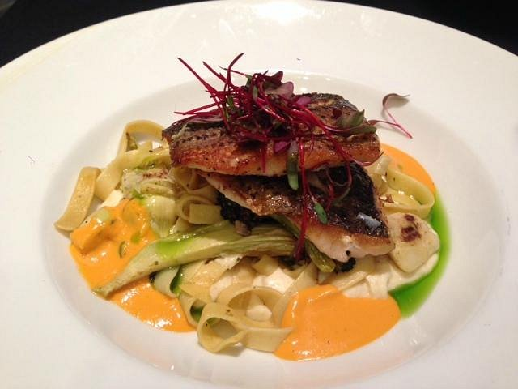

# Mahesh Bashyal's website 

My first website using Markdown and GitHub Pages.

## Links (Two hashes is a second level heading)

[Restaurants in KC](https://www.eater.com/maps/best-restaurants-kansas-city)

## Reminders

Use a dash space for unordered lists

- Spaces matter

- Spelling matter

- Capitalization matters
